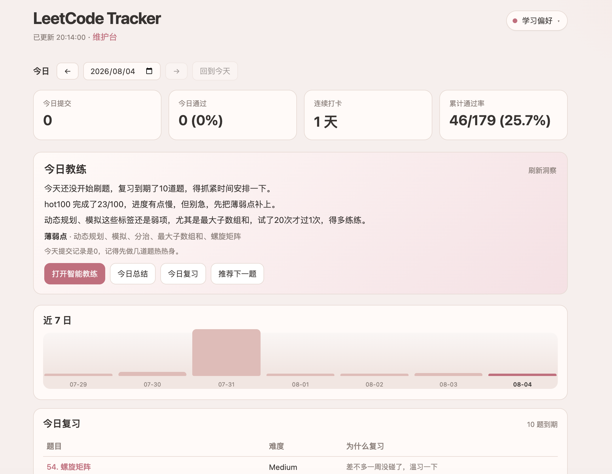
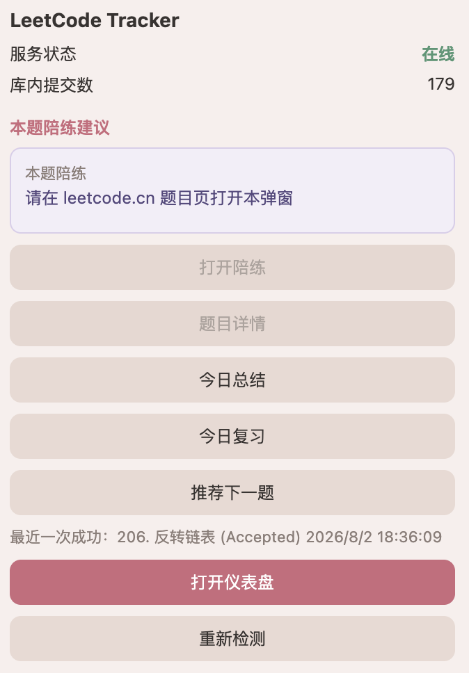

# LeetCode Tracker

**在力扣照常刷题，本机自动记账；可选 AI 陪练帮你复盘、复习、推下一题。**

刷题数据不出本机。不替你写完整答案——先问、再点拨，真正卡住才给思路出口。

[](https://github.com/cungphammanh590-star/leetcode-tracker/releases)
[](https://www.python.org/downloads/)
[](LICENSE)
[](https://github.com/cungphammanh590-star/leetcode-tracker/tree/local-stable)

<p align="center">
  
</p>

<p align="center">
  
</p>

---

## 为什么造它

市面上的力扣工具大多落在两极：要么只记进度、要么当场把答案甩给你。  
LeetCode Tracker 想做中间那一层——**先把你真实的提交历史留下来**，再在需要时用 AI 基于「这道题你怎么卡的」做苏格拉底式陪练；推荐、复习、今日总结的核心选题走规则引擎，不靠模型瞎编。

你继续在 [leetcode.cn](https://leetcode.cn) 写题、提交；Chrome / Edge 扩展静默记账；本机仪表盘看今天、看薄弱点、打开陪练。

---

## 功能

- **无感采集** — 力扣提交后扩展写入本机 SQLite，角标显示 ok；采集与 AI **完全解耦**，模型挂了也不丢记录
- **本机工作台** — 按天概览、连续打卡、近 7 日、到期复习、薄弱标签洞察
- **苏格拉底陪练** — 默认反问与点拨，禁止直接甩完整可运行代码；失稳或显式出口才给诊断 / 思路提纲
- **智能教练（v1.0，可选）** — 云端 Tool-calling Agent，可绑题读代码与错误摘要，多轮对话不泄历史 AC 源码
- **今日总结 / 复习 / 推荐** — **选题逻辑零 LLM**（规则 + 知识图谱 + 题单）；模型只可选润色文案
- **题单 + 知识图谱** — 默认 Hot100；内嵌 algorithm-stone 约 890+ 题路线；支持自定义题单与「已掌握」名单
- **间隔复习 MVP** — 练过的题到期回访（固定间隔，非完整 FSRS）
- **本地或云端模型** — Ollama 本地跑经典陪练，或 DeepSeek API；轻量用户可不装任何 AI

---

## 版本线

| 分支 / 版本 | 定位 |
|-------------|------|
| [`v0.3.4`](https://github.com/cungphammanh590-star/leetcode-tracker/releases/tag/v0.3.4) / [`local-stable`](https://github.com/cungphammanh590-star/leetcode-tracker/tree/local-stable) | 轻量本地追踪：采集、仪表盘、题单、规则推荐/复习；**不含**智能教练 |
| `main` @ **v1.0** | 在轻量能力之上，可选云端「智能教练」（需 DeepSeek API Key） |

只需记账与统计：装 `v0.3.4` 或跟踪 `local-stable` 即可。

---

## 你需要准备什么

- Python **3.9+**（`python` / `python3` 与 `pip`）
- Chrome 或 Edge（加载扩展 + 打开仪表盘）
- [leetcode.cn](https://leetcode.cn) 账号（照常刷题）
- 可选陪练：本机 [Ollama](https://ollama.com/)，或在维护台填写 DeepSeek API Key

不限定操作系统：能跑 Python、能装 Chromium 系扩展即可。

---

## 安装

### 方式 A：下载 ZIP

1. 从 [Releases](https://github.com/cungphammanh590-star/leetcode-tracker/releases) 下载 **Source code (zip)**，或仓库页 `Code` → `Download ZIP`
2. 解压后进入目录：

```bash
cd leetcode-tracker-main   # 目录名以解压结果为准
```

3. 安装：

```bash
python -m pip install .

# 可选：陪练依赖（Ollama / DeepSeek）
python -m pip install ".[coach]"
```

4. 浏览器扩展：加载**同一份目录**里的 `extension/`（见下方「日常使用」）。

### 方式 B：pip 从 Git 安装

```bash
# 轻量版示例
python -m pip install git+https://github.com/cungphammanh590-star/leetcode-tracker.git@v0.3.4

# 可选陪练（需对应版本已含 coach extra）
python -m pip install "leetcode-tracker[coach]"
```

扩展仍需单独准备：克隆仓库或从 Release 下载后，加载其中的 `extension/`。

---

## 日常使用

```bash
leetcode-tracker serve
```

然后：

1. 打开仪表盘：**http://127.0.0.1:8763/**
2. `chrome://extensions`（或 Edge 对应页）→ 开发者模式 → **加载已解压的扩展程序** → 选 `extension/`
3. 在 [leetcode.cn](https://leetcode.cn) 正常做题、提交；扩展角标 **ok** 即表示已记入本机
4. 需要陪练：扩展弹窗「打开陪练」，或工作台「今日教练」里的入口

维护台（题单导入、模型配置、重建统计/图谱）：**http://127.0.0.1:8763/ops**

改端口：

```bash
leetcode-tracker config set port 9000
```

重启 `serve`，并在扩展里确认端口一致后重载扩展。

### 页面一览

| 地址 | 做什么 |
|------|--------|
| `/` | 工作台：按天概览、今日教练、近 7 日、到期复习 |
| `/ops` | 维护台 |
| `/coach` | 陪练对话（SSE 流式） |
| `/problems/{题号}` | 单题详情与掌握标记 |

---

## 陪练怎么工作（可选）

```text
力扣提交 ──► 只写库（永不进 LLM）
                │
                ▼
         prepare（模板开场，不调模型）
                │
                ▼
         stream（SSE 多轮）
           ├─ 经典陪练：LangChain 链（Ollama / DeepSeek）
           ├─ 智能教练：LangGraph 阶段图（仅云端，v1.0）
           └─ 今日总结 / 复习 / 推荐：规则选题 + 可选润色
```

- **只追踪**：不必装 Ollama，也不必填 API Key  
- **本地模型**：启动 Ollama 并拉取模型后，到陪练页发消息  
- **云端**：维护台「陪练模型」选 DeepSeek，填 Key 后保存  
- **智能教练**：学习偏好或维护台开启；**必须**云端 API + Key。首轮意图分流；空闲可续刷/新荐；总结/复习/推荐旁路仍走规则  
- 模型超时有兜底回复，**不影响提交采集**  
- 开发观测（可选）：`LANGSMITH_TRACING=true` + `LANGSMITH_API_KEY`（维护台不配；详见 `docs/COACH.md`）

缺 `langchain-*` 等依赖时：再执行一次 `pip install ".[coach]"` 或 `pip install "leetcode-tracker[coach]"`，然后重启 `serve`。

---

## 自定义题单

在维护台 **http://127.0.0.1:8763/ops** →「学习偏好与题单」：

1. 选择已有题单，或新建（填名称即可，ID 自动生成）
2. 粘贴题目 JSON：`{"problems":[...]}` 或题目数组
3. 默认 **追加**（同题去重）；需要整表替换时选 **覆盖整表**
4. 点 **导入题目**

每题字段：`id`、`slug`、`title`（或 `title_cn`）、`difficulty`、`tags`、`order`。  
维护台可查看样例 JSON。

---

## 常用命令

| 命令 | 用途 |
|------|------|
| `leetcode-tracker serve` | 启动本机服务（自动就绪内嵌路线图与 Hot100） |
| `leetcode-tracker kg import` | 强制重建知识图谱（维护用） |
| `leetcode-tracker kg progress --track dp` | 查看某条路线进度 |
| `leetcode-tracker config set llm.coach_model <name>` | 更换本地陪练模型 |
| `leetcode-tracker autostart install` | 开机自动 `serve`（实现偏 macOS LaunchAgent） |

---

## 数据在哪

| 内容 | 默认路径 |
|------|----------|
| 刷题记录 / 图谱 / 陪练会话 | `~/.local/share/leetcode-tracker/leetcode.db` |
| 配置 | `~/.config/leetcode-tracker/config.json` |

「今日」按 **北京时间** 切日；仪表盘可切换日期回顾历史一天。

---

## 说明与限制

- 仅支持 **leetcode.cn**，无云同步
- 未安装 `[coach]` 时，采集与统计照常可用
- 图谱覆盖约 890+ 题；图谱外的题仍可陪练，只是缺少路线位置信息
- 首页可开关「题单模式 / 知识图谱模式」、管理活跃题单与已掌握名单；默认双模式开启、题单为 Hot100
- 维护台破坏性操作需要确认；本版不提供网页清空全部提交、也不在网页改端口

路线图来自 **algorithm-stone**（MIT），随包装在 `leetcode_tracker/data/algorithm_stone/maps/`。

---

## 技术栈

Python · FastAPI · SQLite · Chrome MV3 扩展 · 可选 LangGraph（智能教练）/ LangChain（经典陪练）/ Ollama / DeepSeek

## License

[MIT](LICENSE)
